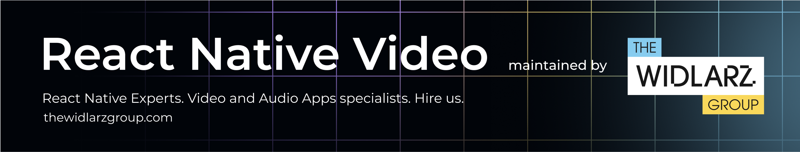
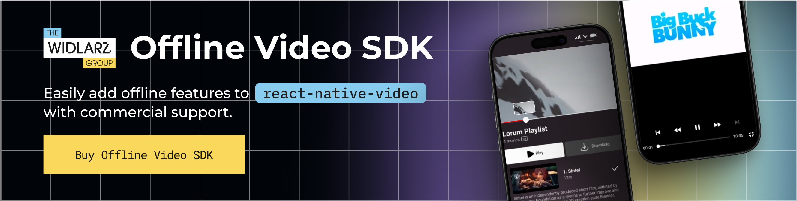

# react-native-video  



The most battle-tested open-source video player component for React Native, powering apps with 10M+ users.


[](https://thewidlarzgroup.com?utm_source=rnv&utm_medium=readme&utm_id=badge)

[](https://www.npmjs.com/package/react-native-video)
[](https://github.com/TheWidlarzGroup/react-native-video/actions)
[](https://discord.gg/9WPq6Yx)
[](https://twitter.com/TheWidlarzGroup)
[](https://thewidlarzgroup.com?utm_source=rnv&utm_medium=readme&utm_id=badge)


## 🔍 Features

- 📱 Plays all video formats natively supported by iOS/Android 
- ▶️ Local **and** remote playback  
- 🔁 Streaming: HLS • DASH • SmoothStreaming  
- 🔐 DRM: Widevine & FairPlay (via optional modules)  
- 📴 **Offline playback**, video download, side-tracks, side-captions support (via [optional SDK](https://docs.thewidlarzgroup.com/offline-sdk?utm_source=rnv&utm_medium=readme&utm_id=features-text))  
- 🎚️ Fine-grained control over tracks, buffering & events
- ⚛️ supports new React Native architecture  
- 🧩 **Expo plugin** support
- 📖 [Extensive documentation](https://docs.thewidlarzgroup.com/react-native-video/)
- 📦 **Guided examples**, DRM example with
[free DRM stream](https://www.thewidlarzgroup.com/services/free-drm-token-generator-for-video?utm_source=rnv&utm_medium=readme&utm_id=free-drm)


## ✨ Project status

| Version | State | Notes |
|---------|-------|-------|
| **v5 and lower** | ❌ *EOL* | No new development. Commercial *maintenance & support* available |
| **v6** | 🛠 *Maintenance by community and [TWG](https://www.thewidlarzgroup.com/?utm_source=rnv&utm_medium=readme&utm_id=table)* | Accepting PRs. Supports new React Native architecture through an interop layer |
| **v7** | 🚀 *In active development by [TWG](https://www.thewidlarzgroup.com/?utm_source=rnv&utm_medium=readme&utm_id=table)* | Public release *soon™*. Supports the new React Native architecture. [Become a **sponsor** for early access.](https://www.thewidlarzgroup.com/?utm_source=rnv&utm_medium=readme&utm_campaign=v7earlyaccess&utm_id=table#Contact) |

> **react-native-video** is a **community-based project** maintained by [TWG](https://www.thewidlarzgroup.com/?utm_source=rnv&utm_medium=readme&utm_id=comment-text) and an awesome open-source community.  
> Your sponsorship accelerates fixes, features, and the next major release. ❤️


## 🚀 Quick start

```bash
# 1 Install
yarn add react-native-video
# 2 Link native deps (RN < 0.60) or autolink (RN ≥ 0.60)
cd ios && pod install
# 3 Use it!
```

```tsx
import Video from 'react-native-video';

export default () => (
  <Video
    source={{ uri: 'https://www.w3schools.com/html/mov_bbb.mp4' }}
    style={{ width: '100%', aspectRatio: 16 / 9 }}
    controls
  />
);
```


## 🧩 Optional modules


### 1 · 📥 Offline SDK
Enable offline streaming with full control over downloads, license lifecycle, secure storage and media access.

* Track selection (bitrate, audio, subtitles)  
* Pause / resume & background queueing  
* Expiration windows & auto-cleanup  
* Built for **Android & iOS**  
* → [SDK documentation](https://docs.thewidlarzgroup.com/offline-sdk?utm_source=rnv&utm_medium=readme&utm_id=modules-sdk-text)

### 2 · 🧪 Plugin architecture
Write your own plugins to extend download logic, attach analytics or add custom workflows - **without forking** the core SDK. [Read more](https://docs.thewidlarzgroup.com/react-native-video/other/plugin)


## 💼 TWG services & products

| Offering | Description | Link |
|----------|-------------|------|
| **Professional Support Packages** | Priority bug-fixes, guaranteed SLAs, roadmap influence | [<https://www.thewidlarzgroup.com/contact>](https://www.thewidlarzgroup.com/services/free-drm-token-generator-for-video?utm_source=rnv&utm_medium=readme&utm_id=free-drm) |
| **Issue Booster** | Pay‑per‑issue fast‑track for urgent fixes | [<https://www.thewidlarzgroup.com/issue-boost>](https://www.thewidlarzgroup.com/issue-boost?utm_source=rnv&utm_medium=readme) |
| **Offline Video SDK** | Plug‑and‑play secure download solution for iOS & Android | [<https://www.thewidlarzgroup.com/offline-video-sdk>](https://www.thewidlarzgroup.com/offline-video-sdk/?utm_source=rnv&utm_medium=readme&utm_campaign=downloading&utm_id=offline-video-sdk-link) |
| **Integration Support** | Hands‑on help integrating video, DRM & offline into your app | [<https://www.thewidlarzgroup.com/contact>](https://www.thewidlarzgroup.com/services/free-drm-token-generator-for-video?utm_source=rnv&utm_medium=readme&utm_id=free-drm)|
| **Free DRM Token Generator** | Generate Widevine / FairPlay tokens for testing |  [<https://www.thewidlarzgroup.com/services/free-drm-token-generator-for-video>](https://www.thewidlarzgroup.com/services/free-drm-token-generator-for-video?utm_source=rnv&utm_medium=readme&utm_id=free-drm) |
| **Ready Boilerplates** | Ready apps with background uploads, Offline HLS/DASH DRM, Video Frames Scrubbing, TikTok video roll, Frame Processor with Skia |  [<https://www.thewidlarzgroup.com/showcases>](https://www.thewidlarzgroup.com/showcases?utm_source=rnv&utm_medium=readme) |

*See how [TWG](https://www.thewidlarzgroup.com/?utm_source=rnv&utm_medium=readme&utm_id=services-text) helped **Learnn** ship a world‑class player in record time - [case study](https://gitnation.com/contents/a-4-year-retrospective-lessons-learned-from-building-a-video-player-from-scratch-with-react-native).*


## 📰 Community & media

- 🗽 **React Summit US** - Learnn CTO explains how [TWG](https://www.thewidlarzgroup.com/?utm_source=rnv&utm_medium=readme&utm_id=community-media-text) Professional Services team fixed critical bugs and boosted video-player performance for their ed-tech platform. [Watch here »](https://gitnation.com/contents/a-4-year-retrospective-lessons-learned-from-building-a-video-player-from-scratch-with-react-native)  
- 🧨 **Nitro Module v7 deep‑dive** - Krzysztof from [TWG](https://www.thewidlarzgroup.com/?utm_source=rnv&utm_medium=readme&utm_id=community-media-text) is explaining why v7 is being written in Nitro Modules [Watch here »](https://x.com/krzysztof_moch/status/1854162551946478051)  


## 🌍 Social

- 🐦 **X / Twitter** - [follow product & release updates](https://x.com/TheWidlarzGroup)
- 💬 **Discord** - [talk to the community and us](https://discord.gg/9WPq6Yx)
- 💼 **LinkedIn** - [see TWG flexing](https://linkedin.com/company/the-widlarz-group)
